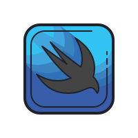
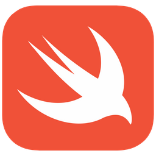

### Hi there 👋

<!-- **NawafSwe/NawafSwe** is a ✨ _special_ ✨ repository because its `README.md` (this file) appears on your GitHub profile. !-->
- Software Engineering Student At KFUPM, iOS & Web Backend Developer At <a href="https://github.com/axenda">@Axenda</a> 💻 .
- I’m currently working on various projects in two different fields backend and ios 🔭 .
- Certified Azure Developer from <a href="https://github.com/microsoft">@Microsoft</a> 😍 🌱 .
- I’m looking to collaborate on open source project specifically on nodejs projects 👯 .
- Ask me about anything on my <a href="https://twitter.com/Nawaf_B_910">twitter</a> 💬 .
- How to reach me 📥 : Nawaf.jr7100@gmail.com .
- Black coffee fan ☕️ .
- Fun fact ⚡ : learing new technologies on my free time is my happiness 😌 .

<!--  Tech I use !-->
<b> ⚡️ My favourite Technologies 💻 ☕️</b>

  <ul>
    
<li>   NodeJS</li>
<li>  SwiftUI</li>
<li>  Swift</li>
<li>   MongoDB </li>
<li>✳️ ExpressJS</li>
<li>  TypeScript</li>
<li>   Javascript</li>
<li>🐍    Python</li>
<li>  Azure</li>
  </ul>

<b>⚡ My GitHub Statistics</b>

<!-- Most Used Languages -->

<footer>NOTE: Top languages are not a skill indicator, it's just a metric of how much public code I have written over the years.</footer>

