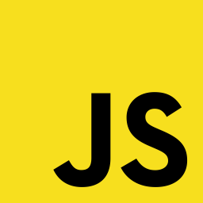

### Hi there 🚀
- I have tried many fields such as backend , mobile, and frontend development, but I am interested in backend development.
- I’m currently working at Sary as a backend software engineer. 🔭
- I'm Interested in Cloud Development. ☁️
- How to reach me 📥 : Nawaf.jr7100@gmail.com.
- I love drinking black coffee every morning ☕️ .
- Fun fact ⚡ : learning new technology topics in my free time is my happiness 😌.

<!--  Tech I use !-->
<b> ⚡️ My favourite Technologies 💻 ☕️</b>

  <ul>
    
<li>   NodeJS</li>
<li>   MongoDB </li>
<li>✳️ ExpressJS</li>
<li>  TypeScript</li>
<li>   Javascript</li>
<li>🐍    Python</li>
    <li>🧪 Jest </li>
    <li>🍃 Spring Boot</li>
    <li>📀 Postgresql</li>
    <li>Django</li>
    <li>🐳 Docker</li>
    <li>AWS</li>
  </ul>

<b>⚡ My GitHub Statistics</b>  

 
   

 

<!-- Most Used Languages -->

<!--   
 
  

    

 -->
 
 
   

    
  

  
 

<footer> <strong>
  NOTE: Top languages are not a skill indicator, it's just a metric of how much public code I have written over the years.
</strong> </footer>

